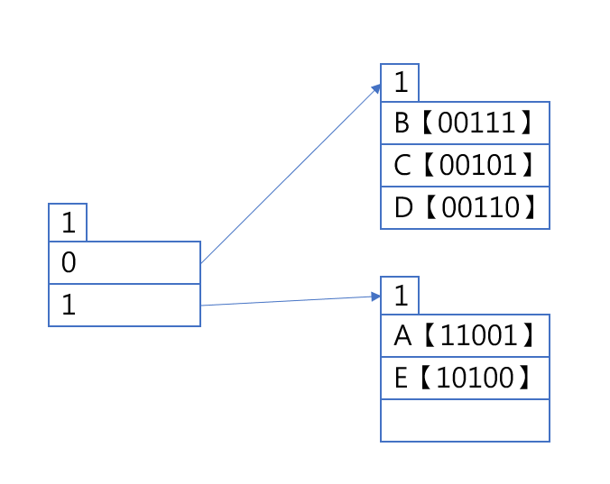
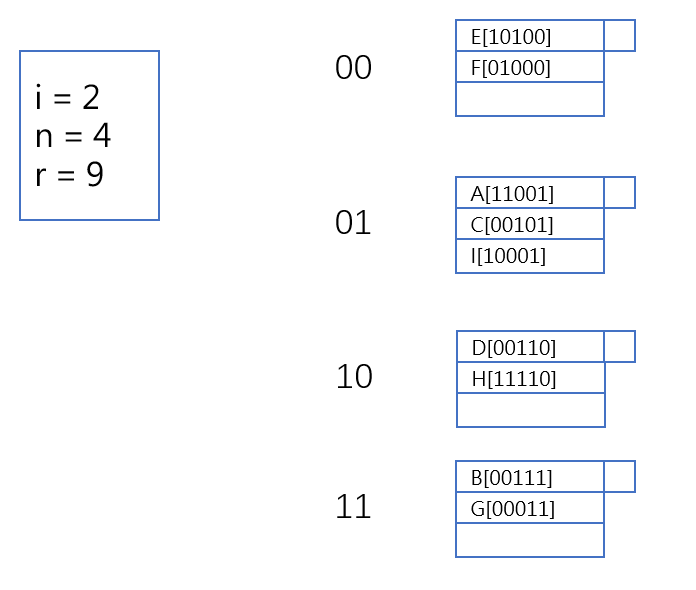

# Database HW 5

PB18111697 王章瀚

## 1.

<table style='width:70%; text-align:center; margin:auto'>
<tr>
    <td>
</img>
</td>
</tr>
</table>

### 1).

不能利用 B+-Tree 来提升查询效率, 因为要想构建 B+-Tree 必须使查找操作的 key 拥有序关系(如序号, 姓名等), 但对于查找同时包含某些关键词的操作, 无法非常直接地构成一个序关系. 因此不太适合使用 B+-Tree 作索引.

### 2).

构建一个带间接桶辅助索引. 对于每一篇 paper, 
- 插入的时候就将其title内所有关键词提取出来, 并从相应关键词的桶里指向该 paper. 
- 查询的时候只需要将用户给出的关键词相应的桶都取出, 然后取一个交集即可.
- 索引表扩展等问题同正常索引.

<table style='width:70%; text-align:center; margin:auto'>
<tr>
    <td>
</img>
</td>
</tr>
</table>

## 2.

<table style='width:70%; text-align:center; margin:auto'>
<tr>
    <td>
</img>
</td>
</tr>
</table>

### 1).

每个桶可以有三个键值. 不妨假设刚开始以最高 1 位表示桶, 则插入 A, B, C, D, E 后有:

<table style='width:40%; text-align:center; margin:auto'>
<tr>
    <td>
</img>
</td>
</tr>
</table>

插入 F 的时候需要扩展, 如下:

<table style='width:40%; text-align:center; margin:auto'>
<tr>
    <td>
</img>
</td>
</tr>
</table>

插入 G 的时候需要扩展, 如下:

<table style='width:50%; text-align:center; margin:auto'>
<tr>
    <td>
</img>
</td>
</tr>
</table>

插入 H, 如下:

<table style='width:50%; text-align:center; margin:auto'>
<tr>
    <td>
</img>
</td>
</tr>
</table>

插入 I 需要扩展, 如下:

<table style='width:50%; text-align:center; margin:auto'>
<tr>
    <td>
</img>
</td>
</tr>
</table>

插入 J, K, L, M, 如下:

<table style='width:50%; text-align:center; margin:auto'>
<tr>
    <td>
</img>
</td>
</tr>
</table>

插入 N 需要扩展, 如下:

<table style='width:60%; text-align:center; margin:auto'>
<tr>
    <td>
</img>
</td>
</tr>
</table>

因此最后有 6 个桶, 键值 E【10100】 所在桶全部键值为:  E【10100】, I【10001】, K【10101】.

### 2).

插入 A, B, C, D 之后, 得到如下:

<table style='width:40%; text-align:center; margin:auto'>
<tr>
    <td>
</img>
</td>
</tr>
</table>

插入 E 之后 $\frac{5}{3 * 2} > 80\%$, 应当扩展, 然后还能继续插入 F, 得到如下:

<table style='width:40%; text-align:center; margin:auto'>
<tr>
    <td>
</img>
</td>
</tr>
</table>

插入 G 的时候, 需要溢出块:

<table style='width:40%; text-align:center; margin:auto'>
<tr>
    <td>
</img>
</td>
</tr>
</table>

插入 H 的时候, 需要扩展, 然后可以直接插入 I:

<table style='width:40%; text-align:center; margin:auto'>
<tr>
    <td>
</img>
</td>
</tr>
</table>

插入 J 需要扩展:

<table style='width:60%; text-align:center; margin:auto'>
<tr>
    <td>
</img>
</td>
</tr>
</table>

插入 K, L, M, N 都可以直接插入:

<table style='width:60%; text-align:center; margin:auto'>
<tr>
    <td>
</img>
</td>
</tr>
</table>

因此共有 5 个桶(溢出块不算桶). 键值 $B[00111]$ 所在得桶全部键值为: $B[00111], G[00011], N[11111]$

## 3.

<table style='width:70%; text-align:center; margin:auto'>
<tr>
    <td>
</img>
</td>
</tr>
</table>

在此题中, 读取一个磁盘块所需的时间是 $R+S+T$. 假设一个磁盘块恰好能够存储一个B+ Tree 节点.

那么对于 n 阶压缩 B+ 树, 它存储 $N$ 个记录最多需要约 $\log_{2n} N$ 层,

每层中查找时, 只会针对一个块内进行遍历, 而每次都要调入块:
- 每块调入需要 $R+S+T$
- 每块遍历找键值需要 $2n\times c=2cn$

因此查找给定记录的地址时间是: $(R+S+T+2cn)\log{2n} N$
