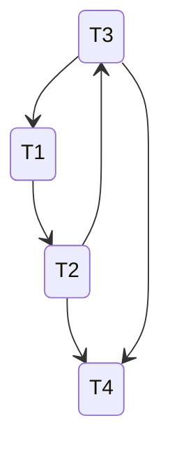

# Database HW6

PB18111697 王章瀚

-----

## 1.
**什么是事务的 ACID 性质? 请给出违背事务 ACID 性质的具体例子, 每个性质举一
个例子.**

- **A** 是指 **原子性 Atomicity**: 表示事务是不可分的原子, 其中的操作要么都做, 要么都不做
    - **违反的例子**: 如一个事务内有多个写入操作, 但在执行了部分写入操作(并已经写入磁盘)后, 由于电源等问题导致系统下线, 若没有相应的恢复机制, 则会导致违反原子性.
- **C** 是指 **一致性 Consistency**: 表示事务的执行保证数据库从一个一致状态转到另一个一致状态
    - **违反的例子**: 如 PPT 20 页所示, 如果要求总量 $a_1+\cdots + a_n=TOT$, 那么如果做这样一个事务:
    ```
    a2 <- a2 + 100
    TOT <- TOT + 100
    ```
    则在刚执行完 `a2 <- a2 + 100` 后, 并不满足总量表达式, 处于短暂的不一致状态.
- **I** 是指 **隔离性 Isolation**: 表示多个事务一起执行时相互独立
    - **违反的例子**: 如果违反隔离性, 比如两个事务能够同时修改同一个对象, 那么就可能因为两个事务内的操作的先后顺序而导致最终结果的不确定性.
- **D** 是指 **持久性 Durability**: 表示事务一旦成功提交, 就在数据库永久保存
    - **违反的例子**: 如果事务提交后, 还在内存中缓存, 或者系统突然崩溃没能写入持久化存储的磁盘/硬盘中, 就会导致违反持久性.

## 2.

**目前许多 DBMS 例如 MySQL 都默认不支持嵌套事务(即在一个事务内部又开始另
一个事务), 请分析一下：如果 DBMS 支持嵌套事务, 将面临哪些问题(至少写出 2
点以上并且要给出自己的分析)?**

可能面临的问题:
1. 需要决定多层事务的提交和回滚策略. 如内层事务提交成功但外层回滚, 这时候是否需要将内层的也进行回滚等问题; 或者内层事务的提交可能需要推迟到最后一起提交, 也会产生一些问题.
2. 由于事务内部可能是不一致的, 嵌套的事务可能面临不一致的数据库信息, 这样处理起来要保持整体的一致性会有麻烦.

## 3.

**下面是一个数据库系统开始运行后的日志记录, 该数据库系统支持检查点.**

```
1)  <T1, Begin Transaction>
2)  <T1, A, 10, 40>
3)  <T2, Begin Transaction>
4)  <T1, B, 20, 60>
5)  <T1, A, 40, 75>
6)  <T2, C, 30, 50>
7)  <T2, D, 40, 80>
8)  <T1, Commit Transaction>
9)  <T3, Begin Transaction>
10) <T3, E, 50, 90>
------------------------------------①
11) <T2, D, 80, 65>
12) <T2, C, 50, 75>
13) <T2, Commit Transaction>
------------------------------------②
14) <T3, Commit Transaction>
15) <CHECKPOINT>
16) <T4, Begin Transaction>
17) <T4, F, 60, 120>
18) <T4, G, 70, 140>
------------------------------------③
19) <T4, F, 120, 240>
20) <T4, Commit Transaction>
```

**设日志修改记录的格式为 <Tid, Variable, Old value, New value>, 请给出对于题中所示①、②、③三种故障情形下, 数据库系统恢复的过程以及数据元素 A, B, C, D, E, F 和 G 在执行了恢复过程后的值.**

**故障情形 ①**:
恢复过程: 
```c
1. Undo 列表 {T2, T3}; Redo 列表 {T1}
2. Undo
    T3: E = 50
3. Redo
    T1: A = 40
    T1: B = 60
    T1: A = 75
4. Write log
    <Abort, T2>
    <Abort, T3>
```

各元素执行恢复后值为:
```c
A = 75, B = 60, C = 30, D = 40, E = 50, F = 60, G = 70
```

**故障情形 ②**
恢复过程: 
```c
1. Undo 列表 {T3}; Redo 列表 {T1, T2}
2. Undo
    T3: E = 50
    T2: D = 40
    T2: C = 30
3. Redo
    T1: A = 40
    T1: B = 60
    T1: A = 75
    T2: C = 50
    T2: D = 80
    T2: D = 65
    T2: C = 75
4. Write log
    <Abort, T3>
```

各元素执行恢复后值为:
```c
A = 75, B = 60, C = 75, D = 65, E = 50, F = 60, G = 70
```

**故障情形 ③**
恢复过程: 
```c
1. Undo 列表 {T4}; Redo 列表 {}
2. Undo
    T4: G = 70
    T4: F = 60
3. Redo:

4. Write log
    <Abort, T4>
```

各元素执行恢复后值为:
```c
A = 75, B = 60, C = 75, D = 65, E = 50, F = 60, G = 70
```

## 4.

**证明：如果一个并发调度 S 中的所有事务都遵循 2PL, 则该调度必定是冲突可串调度.**

简而言之, 对于遵循 2PL 的这些事务, 只要能够正常执行(不发生死锁), 那么任意两个事务 $T_1$ 和 $T_2$ 就必须获得相应的锁才能开始正式执行, 因为锁具有互斥性质, 所以 $T_1$ 在执行的时候, $T_2$ 必不会执行, 反之亦然, 二者不会有相互干扰.

更严格的证明可以这样说:
如果几个事务在优先图中构成了环, 例如 $T1\rightarrow T2\rightarrow \cdots\rightarrow Tn\rightarrow T1$, 
那么由于 2PL 的事务执行需要获得全部的锁, 然后执行后再统一释放所有锁, 
故 $Tn$ 的执行必然依赖于 $T1$ 的完成, 而 $T1$ 又需要 $Tn$ 的完成. 这种情况下就会产生死锁.
所以只要 2PL 调度不产生死锁, 事务在优先图中就不会构成环. 因此必然是冲突可串调度的.

## 5.

**采用了两阶段锁协议的事务是否一定不会出现脏读问题? 如果不会, 请解释理由；如果会, 请给出一个例子.**

不会出现. 脏读出现在某个事务因一些问题而撤销操作, 但另一事务在撤销前就读到了数据而导致了使用了 invalid 的数据. 但两阶段锁中, 新的读写事务对于正在进行的写操作的事务都是互斥的, 必须先获得锁才能读写.

但如果其他事务持有写锁的时候可以拿到读锁, 那么就可能导致脏读, 如
|T1|T2|
|:-|:-|
|Write(A,100)||
||Read(A, t)|
|RollBack|t = t + 100|

这时候读到的 t 就算是脏数据.

## 6.

**判断下面的并发调度是否冲突可串? 如果是, 请给出冲突等价的串行调度事务顺序；如果不是, 请解释理由.**
**w3(D); r1(A); w2(A); r4(A); r1(C); w2(B); r3(B); r3(A); w1(D); w3(B); r4(B); r4(C); w4(C); w4(B)**

**不是**. 可以画出其优先图(可能不完全, 但足以判断):


显然构成了环, 因此不是冲突可串的. 具体是 `w3(D) - w1(D)`, `r1(A) - w2(A)`, `w2(A) - r3(A)` 构成了环 (可能还有别的)
